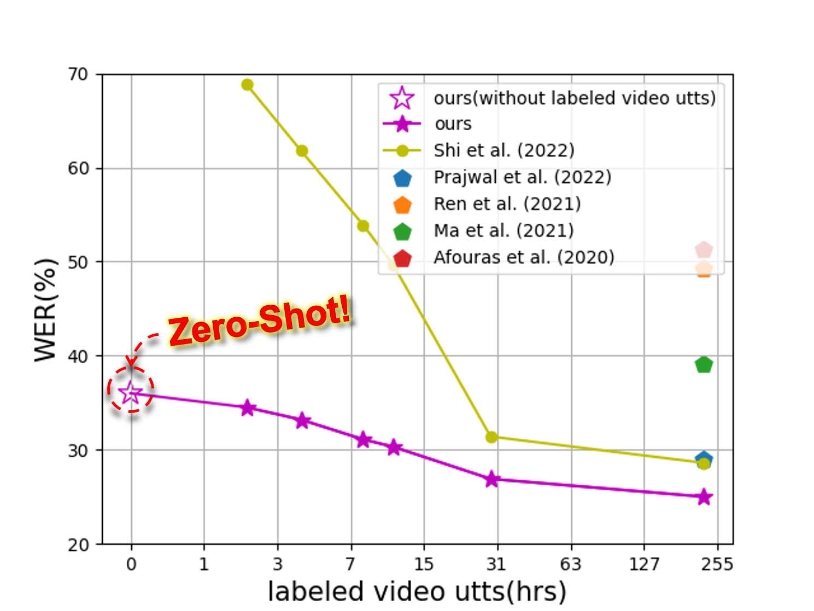

# OpenSR: Open-Modality Speech Recognition via Maintaining Multi-Modality Alignment

#### Xize Cheng*, Tao Jin*, Linjun Li*, Wang Lin, Xinyu Duan, Zhou Zhao | Zhejiang University & Huawei Cloud

PyTorch Implementation of [OpenSR (ACL'23 Oral)](https://arxiv.org/abs/2306.06410): an open modality training framework that can be trained on a single modality and applied to multiple modalities.



If you find OpenSR useful in your research, please use the following BibTeX entry for citation.
```BibTeX
@misc{cheng2023opensr,
      title={OpenSR: Open-Modality Speech Recognition via Maintaining Multi-Modality Alignment}, 
      author={Xize Cheng and Tao Jin and Linjun Li and Wang Lin and Xinyu Duan and Zhou Zhao},
      year={2023},
      eprint={2306.06410},
      archivePrefix={arXiv},
      primaryClass={cs.CL}
}
```

## Installation
First, create a conda virtual environment and activate it:
```
conda create -n openSR python=3.8 -y
conda activate openSR
```
Then, clone this directory:
```
git clone https://github.com/Exgc/OpenSR.git
cd OpenSR
git submodule init
git submodule update
```

Lastly, install Fairseq and the other packages:
```
pip install -r requirements.txt
cd fairseq
pip install --editable ./
```

## Open-Modality Speech Recognition (OpenSR)

### 1. Data preparation
Follow the steps in [`preparation`](avhubert/preparation/) to pre-process:
- LRS2 and LRS2-COMMON dataset

### 2. Audio-Visual Alignment Learning

Refer to the audio-visual speech pre-training model [AV-HuBERT](https://github.com/facebookresearch/av_hubert). 
The pretraining checkpoints can be found at [here](http://facebookresearch.github.io/av_hubert).

### 3. Decoder Training with Audio only

Suppose `{train,valid}.tsv` are saved at `/path/to/data`, `{train,valid}.wrd`
are saved at `/path/to/labels`, the configuration file is saved at `/path/to/conf/conf-name`,
the model will be saved at `/path/to/checkpoint`.

To train the decoder with audio only, we run with the settings of `opensr/opensr_large_vox_audio.yaml`:
```sh
$ cd opensr
$ fairseq-hydra-train --config-dir /path/to/conf/ --config-name opensr/opensr_large_vox_audio.yaml \
  task.data=/path/to/data task.label_dir=/path/to/label \
  task.tokenizer_bpe_model=/path/to/tokenizer model.w2v_path=/path/to/checkpoint \
  hydra.run.dir=/path/to/experiment/opensr common.user_dir=`pwd`
```
### 4. Tuning of the Target-domain Decoder

#### Full-Shot
We further tune the model with the entire visual utterances, we run with the setting of 
`opensr/large_vox_video.yaml` or `opensr/large_vox_audio_video.yaml`:

```sh
$ cd opensr
$ cp /path/to/experiment/opensr/checkpoint_best.pt /path/to/experiment/full-shot/checkpoint_last.pt
$ fairseq-hydra-train --config-dir /path/to/conf/ --config-name opensr/large_vox_video.yaml \
  task.data=/path/to/data task.label_dir=/path/to/label \
  task.tokenizer_bpe_model=/path/to/tokenizer model.w2v_path=/path/to/checkpoint \
  hydra.run.dir=/path/to/experiment/full-shot common.user_dir=`pwd`
```

#### Few-Shot
We tune the model with visual speech of common words only, we run with the setting of `prompt/large_vox_base_{10,20,50,100}.yaml`
The number of the clustering centers can be defined with the `prompt_strategy: base_{number of centers}` in the yaml.
```sh
$ cd opensr
$ cp /path/to/experiment/opensr/checkpoint_best.pt /path/to/experiment/few-shot/checkpoint_last.pt
$ fairseq-hydra-train --config-dir /path/to/conf/ --config-name prompt/large_vox_base_{10,20,50,100}.yaml \
  task.data=/path/to/data task.label_dir=/path/to/label \
  task.tokenizer_bpe_model=/path/to/tokenizer model.w2v_path=/path/to/checkpoint \
  hydra.run.dir=/path/to/experiment/few-shot common.user_dir=`pwd`
```
#### Zero-Shot & Inference
Suppose the `test.tsv` and `test.wrd` are the video list and transcripts of
the split to be decoded, saved at `/path/to/data`. `task.normalize` needs to be consistent with the value used during fine-tuning.
Decoding results will be saved at `/path/to/experiment/decode/s2s/test`.

- For Zero-Shot, we directly inference with the model saved in `/path/to/experiment/opensr` 
- For Full-Shot and Few-Shot, we inference with the model saved in `/path/to/experiment/{full-shot,few-shot}`

```sh
$ cd opensr
$ python -B infer_s2s.py --config-dir ./conf/ --config-name conf-name \
  dataset.gen_subset=test common_eval.path=/path/to/experiment/{opensr,few-shot,full-shot} \
  common_eval.results_path=/path/to/experiment/decode/s2s/test \
  override.modalities=['video'] common.user_dir=`pwd`
```

The command above uses the default decoding hyperparameter, which can be found
in `conf/s2s_decode.yaml`. `override.modalities` can be set to `['video']` (for lip reading),
or `['audio']` (for ASR) or `['audio','video']` (for audio-visual speech recognition).These parameters can be
configured from the command line. For example, to search with a beam size of
20, we can append the command above with `generation.beam=20`.
Important parameters include:
- generation.beam
- generation.lenpen

